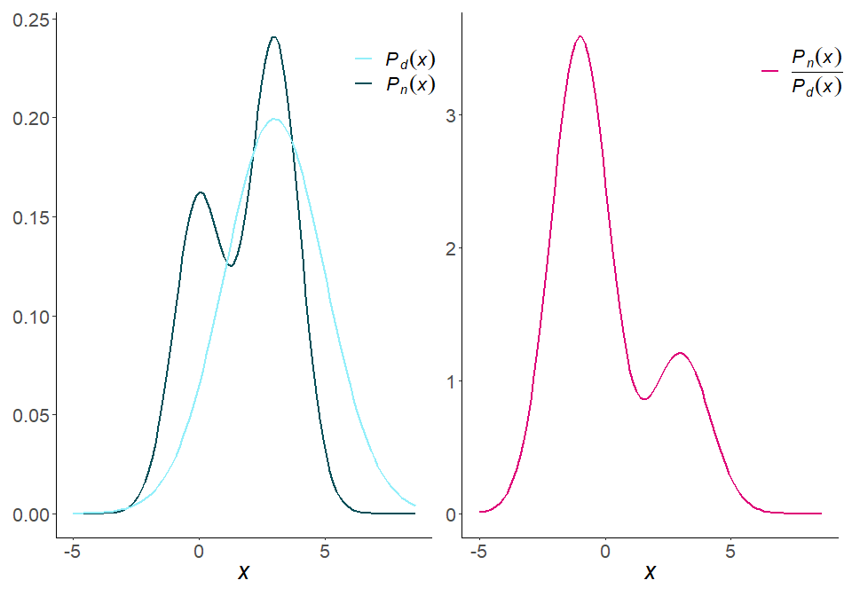

<!-- README.md is generated from README.Rmd. Please edit that file -->
<p align="center">



</p>
<p align="center">
<a href="https://github.com/thomvolker/densityratio/actions/workflows/R-CMD-check.yaml"></img></a>
<a href="https://lifecycle.r-lib.org/articles/stages.html#experimental"></img></a>
<a href="https://CRAN.R-project.org/package=densityratio"></img></a>
<h5 align="center">
Density ratio estimation for distribution comparison.
</h5>
</p>

# Description

This is an `R`-package for distribution comparison through density ratio
estimation. The package provides functionality to estimate the density
ratio $$r(x) = \frac{p_\text{nu}(x)}{p_{\text{de}}(x)}$$ directly,
without going through density estimation of the numerator and
denominator density separately. Density ratio estimation serves many
purposes, for example, prediction, outlier detection, change-point
detection in time-series, importance weighting under domain adaptation
(i.e., sample selection bias) and evaluation of synthetic data utility.
The key idea is that differences between data distributions can be
captured in their density ratio, which is estimated over the entire
multivariate space of the data. Subsequently, the density ratio values
can be used to summarize the dissimilarity between the two distributions
in a discrepancy measure.

## Installation

You can install the development version of densityratio from
[GitHub](https://github.com/) with:

``` r
# install.packages("devtools")
devtools::install_github("thomvolker/densityratio")
```

## Example

This is a basic example which shows you how to solve a common problem:

``` r
library(densityratio)
## basic example code
```

What is special about using `README.Rmd` instead of just `README.md`?
You can include R chunks like so:

``` r
summary(cars)
#>      speed           dist       
#>  Min.   : 4.0   Min.   :  2.00  
#>  1st Qu.:12.0   1st Qu.: 26.00  
#>  Median :15.0   Median : 36.00  
#>  Mean   :15.4   Mean   : 42.98  
#>  3rd Qu.:19.0   3rd Qu.: 56.00  
#>  Max.   :25.0   Max.   :120.00
```

You’ll still need to render `README.Rmd` regularly, to keep `README.md`
up-to-date. `devtools::build_readme()` is handy for this. You could also
use GitHub Actions to re-render `README.Rmd` every time you push. An
example workflow can be found here:
<https://github.com/r-lib/actions/tree/v1/examples>.

You can also embed plots, for example:


In that case, don’t forget to commit and push the resulting figure
files, so they display on GitHub and CRAN.
