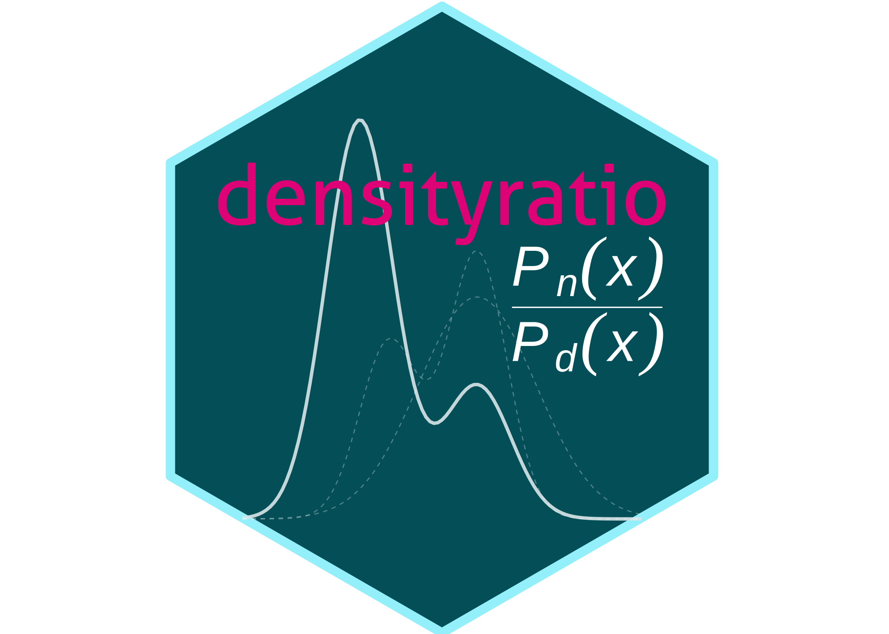
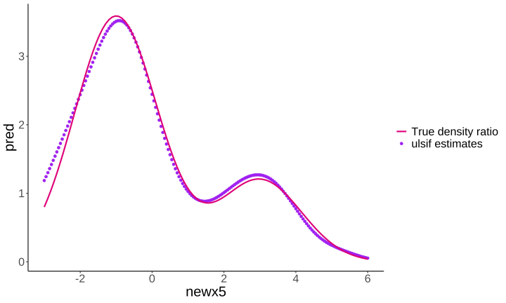
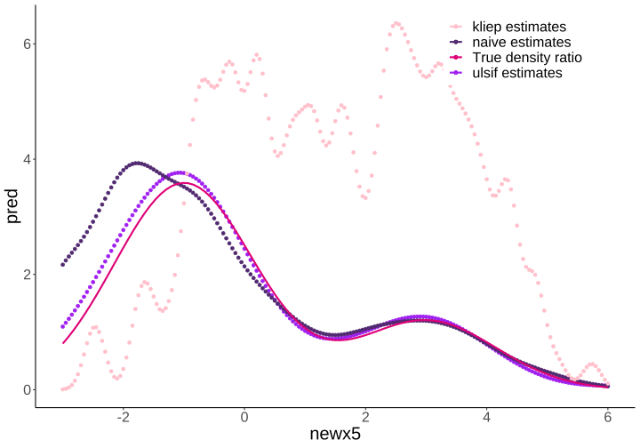

<!-- README.md is generated from README.Rmd. Please edit that file -->

# densityratio 

<!-- badges: start -->

[](https://github.com/thomvolker/densityratio/actions/workflows/R-CMD-check.yaml)
[](https://lifecycle.r-lib.org/articles/stages.html#experimental)
[](https://thomvolker.r-universe.dev/densityratio)
[](https://zenodo.org/badge/latestdoi/613441108)

<!-- badges: end -->

## Overview

This package provides functionality to directly estimate a density ratio
$$r(x) = \frac{p_\text{nu}(x)}{p_{\text{de}}(x)},$$ without estimating
the numerator and denominator density separately. Density ratio
estimation serves many purposes, for example, prediction, outlier
detection, change-point detection in time-series, importance weighting
under domain adaptation (i.e., sample selection bias) and evaluation of
synthetic data utility. The key idea is that differences between data
distributions can be captured in their density ratio, which is estimated
over the entire multivariate space of the data. Subsequently, the
density ratio values can be used to summarize the dissimilarity between
the two distributions in a discrepancy measure.


### Features

- **Fast**: Computationally intensive code is executed in `C++` using
  `Rcpp` and `RcppArmadillo`.
- **Automatic**: Good default hyperparameters that can be optimized in
  cross-validation (we do recommend understanding those parameters
  before using `densityratio` in practice).
- **Complete**: Several density ratio estimation methods, such as
  unconstrained least-squares importance fitting (`ulsif()`),
  Kullback-Leibler importance estimation procedure (`kliep()`), ratio of
  estimated densities (`naive()`), ratio of estimated densities after
  dimension reduction (`naivesubspace()`), and least-squares
  heterodistributional subspace search (`lhss()`; experimental).
- **User-friendly**: Simple user interface, default `predict()`,
  `print()` and `summary()` functions for all density ratio estimation
  methods; built-in data sets for quick testing.

## Installation

You can install the development version of `densityratio` from
[R-universe](https://r-universe.dev/search/) with:

``` r
install.packages('densityratio', repos = 'https://thomvolker.r-universe.dev')
```

## Usage

The package contains several functions to estimate the density ratio
between the numerator data and the denominator data. To illustrate the
functionality, we make use of the in-built simulated data sets
`numerator_data` and `denominator_data`, that both consist of the same
five variables.

### Minimal example

``` r
library(densityratio)
#> Warning: package 'densityratio' was built under R version 4.3.2

head(numerator_data)
#> # A tibble: 6 × 5
#>   x1    x2         x3     x4     x5
#>   <fct> <fct>   <dbl>  <dbl>  <dbl>
#> 1 A     G1    -0.0299  0.967 -1.26 
#> 2 C     G1     2.29   -0.475  2.40 
#> 3 A     G1     1.37    0.577 -0.172
#> 4 B     G2     1.44   -0.193 -0.708
#> 5 A     G1     1.01    2.23   2.01 
#> 6 C     G2     1.83    0.762  3.71

set.seed(1)

fit  <- ulsif(
  df_numerator = numerator_data$x5, 
  df_denominator = denominator_data$x5, 
  nsigma = 5, 
  nlambda = 5
)

class(fit)
#> [1] "ulsif"
```

We can ask for the `summary()` of the estimated density ratio object,
that contains the optimal kernel weights (optimized using
cross-validation) and a measure of discrepancy between the numerator and
denominator densities.

``` r
summary(fit)
#> 
#> Call:
#> ulsif(df_numerator = numerator_data$x5, df_denominator = denominator_data$x5,     nsigma = 5, nlambda = 5)
#> 
#> Kernel Information:
#>   Kernel type: Gaussian with L2 norm distances
#>   Number of kernels: 200
#>   Optimal sigma: 0.8951539
#>   Optimal lambda: 0.03162278
#>   Optimal kernel weights (loocv): num [1:200] 0.021815 0.007418 0.018196 0.015729 -0.000559 ...
#>  
#> Pearson divergence between P(nu) and P(de): 0.2925
#> For a two-sample homogeneity test, use 'summary(x, test = TRUE)'.
```

To formally evaluate whether the numerator and denominator densities
differ significantly, you can perform a two-sample homogeneity test as
follows.

``` r
summary(fit, test = TRUE)
#> 
#> Call:
#> ulsif(df_numerator = numerator_data$x5, df_denominator = denominator_data$x5,     nsigma = 5, nlambda = 5)
#> 
#> Kernel Information:
#>   Kernel type: Gaussian with L2 norm distances
#>   Number of kernels: 200
#>   Optimal sigma: 0.8951539
#>   Optimal lambda: 0.03162278
#>   Optimal kernel weights (loocv): num [1:200] 0.021815 0.007418 0.018196 0.015729 -0.000559 ...
#>  
#> Pearson divergence between P(nu) and P(de): 0.2925
#> Pr(P(nu)=P(de)) < .001
#> Bonferroni-corrected for testing with r(x) = P(nu)/P(de) AND r*(x) = P(de)/P(nu).
```

The probability that numerator and denominator samples share a common
data generating mechanism is very small.

The `ulsif`-object also contains the (hyper-)parameters used in
estimating the density ratio, such as the centers used in constructing
the Gaussian kernels (`fit$centers`), the different bandwidth parameters
(`fit$sigma`) and the regularization parameters (`fit$lambda`). Using
these variables, we can obtain the estimated density ratio using
`predict()`.

``` r
# obtain predictions for the numerator samples

newx5 <- seq(from = -3, to = 6, by = 0.05)
pred  <- predict(fit, newdata = newx5)

ggplot() +
  geom_point(aes(x = newx5, y = pred, col = "ulsif estimates")) +
  stat_function(mapping = aes(col = "True density ratio"), 
                fun = dratio, 
                args = list(p = 0.4, dif = 3, mu = 3, sd = 2),
                size = 1) +
  theme_classic() +
  scale_color_manual(name = NULL, values = c("#de0277", "purple")) +
  theme(legend.position = c(0.8, 0.9),
        text = element_text(size = 20))
```



### Categorical data

Currently, none of the functions in the `densityratio` package accept
non-numeric variables (e.g., having categorical variables will return an
error message).

``` r
ulsif(
  df_numerator = numerator_data$x1, 
  df_denominator = denominator_data$x2
)
#> Error in check.dataform(nu, de): Currently only numeric data is supported.
```

However, transforming the variables into numeric variables will work,
and can give a reasonable estimate of the ratio of proportions in the
different data sets (although there is some regularization applied).

``` r
fit_cat <- ulsif(
  df_numerator = numerator_data$x1 |> as.numeric(),
  df_denominator = denominator_data$x1 |> as.numeric()
)
#> Warning in check.sigma(nsigma, sigma_quantile, sigma, dist_nu): There are duplicate values in 'sigma', only the unique values are used.

aggregate(
  predict(fit_cat) ~ numerator_data$x1,
  FUN = unique
)
#>   numerator_data$x1 predict(fit_cat)
#> 1                 A        1.3585735
#> 2                 B        1.3698165
#> 3                 C        0.6285726


table(numerator_data$x1) / table(denominator_data$x1)
#> 
#>         A         B         C 
#> 1.3928571 1.4612069 0.6007752
```

### Full data example

After transforming all variables to numeric variables, it is possible to
calculate the density ratio over the entire multivariate space of the
data.

``` r
fit_all <- ulsif(
  df_numerator = numerator_data |> lapply(as.numeric) |> data.frame(),
  df_denominator = denominator_data |> lapply(as.numeric) |> data.frame()
)

summary(fit_all, test = TRUE, parallel = TRUE)
#> 
#> Call:
#> ulsif(df_numerator = data.frame(lapply(numerator_data, as.numeric)),     df_denominator = data.frame(lapply(denominator_data, as.numeric)))
#> 
#> Kernel Information:
#>   Kernel type: Gaussian with L2 norm distances
#>   Number of kernels: 200
#>   Optimal sigma: 1.474584
#>   Optimal lambda: 0.3359818
#>   Optimal kernel weights (loocv): num [1:200] -0.02004 -0.00362 0.10225 0.03995 0.03609 ...
#>  
#> Pearson divergence between P(nu) and P(de): 0.5093
#> Pr(P(nu)=P(de)) < .001
#> Bonferroni-corrected for testing with r(x) = P(nu)/P(de) AND r*(x) = P(de)/P(nu).
```

### Other density ratio estimation functions

Besides `ulsif()`, the package contains several other functions to
estimate a density ratio.

- `naive()` estimates the numerator and denominator densities
  separately, and subsequently takes there ratio.
- `kliep()` estimates the density ratio directly through the
  Kullback-Leibler importance estimation procedure.
  <!-- * `kmm()` estimates the density ratio for the denominator sample points only through kernel mean matching.  -->

``` r
set.seed(1)

fit_naive <- naive(
  df_numerator = numerator_data$x5, 
  df_denominator = denominator_data$x5
)

fit_kliep <- kliep(
  df_numerator = numerator_data$x5, 
  df_denominator = denominator_data$x5,
  maxit = 10000
)

pred_naive <- predict(fit_naive, newdata = newx5)
pred_kliep <- predict(fit_kliep, newdata = newx5)

ggplot(data = NULL, aes(x = newx5)) +
  geom_point(aes(y = pred, col = "ulsif estimates")) +
  geom_point(aes(y = pred_naive, col = "naive estimates")) +
  geom_point(aes(y = pred_kliep, col = "kliep estimates")) +
  stat_function(aes(x = NULL, col = "True density ratio"), 
                fun = dratio, args = list(p = 0.4, dif = 3, mu = 3, sd = 2),
                size = 1) +
  theme_classic() +
  scale_color_manual(name = NULL, values = c("pink", "#512970","#de0277", "purple")) +
  theme(legend.position = c(0.8, 0.9),
        text = element_text(size = 20))
```



The figure directly shows that `ulsif()` and `kliep()` come rather close
to the true density ratio function in this example, and outperform the
`naive()` solution.

## Contributions

This package is still in development, and I’ll be happy to take feedback
and suggestions. Please submit these through [GitHub
Issues](https://github.com/thomvolker/densityratio/issues).

## Resources

**Books**

- General information about the density ratio estimation framework:
  Sugiyama, Suzuki and Kanamori (2012). [Density Ratio Estimation in
  Machine
  Learning](https://www.cambridge.org/core/books/density-ratio-estimation-in-machine-learning/BCBEA6AEAADD66569B1E85DDDEAA7648)

**Papers**

- Density ratio estimation for the evaluation of the utility of
  synthetic data: Volker, De Wolf and Van Kesteren (2023). [Assessing
  the utility of synthetic data: A density ratio
  perspective](https://unece.org/statistics/documents/2023/08/working-documents/assessing-utility-synthetic-data-density-ratio)

## How to cite

Volker, T.B. (2023). densityratio: Distribution comparison through
density ratio estimation. <https://doi.org/10.5281/zenodo.8307819>
