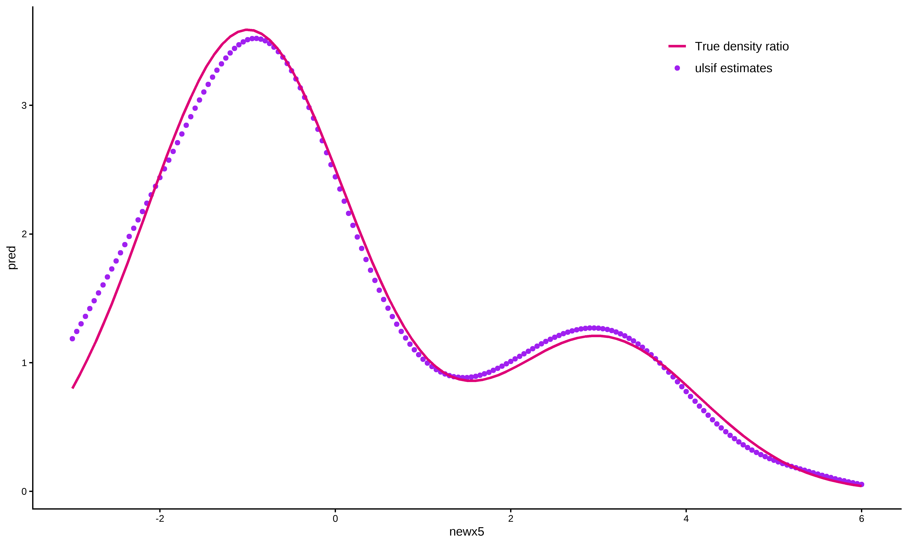
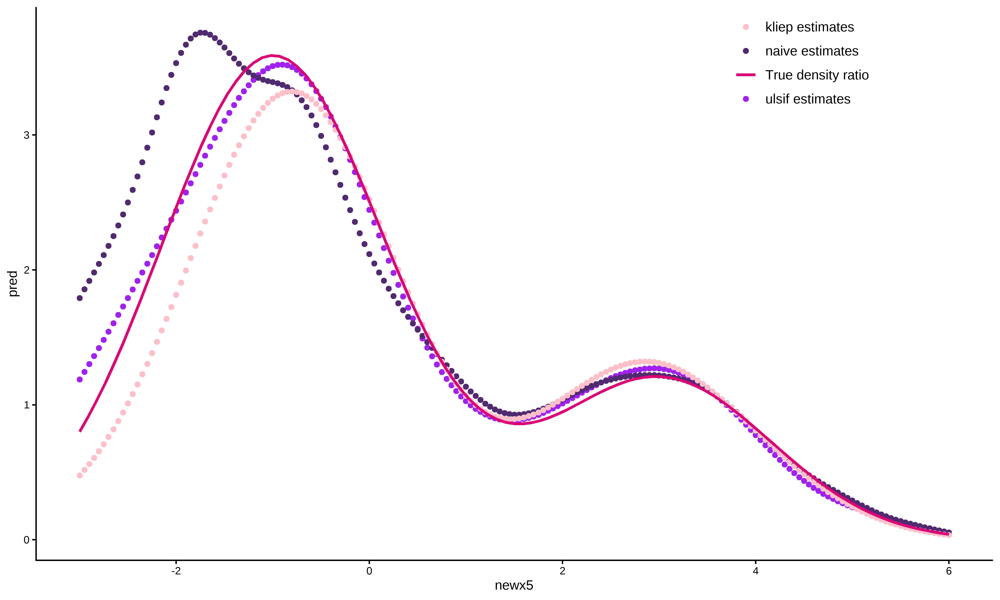

<!-- README.md is generated from README.Rmd. Please edit that file -->

# densityratio 

<!-- badges: start -->

[](https://github.com/thomvolker/densityratio/actions/workflows/R-CMD-check.yaml)
[](https://lifecycle.r-lib.org/articles/stages.html#experimental)
[](https://CRAN.R-project.org/package=densityratio)

<!-- badges: end -->

## Overview

This is an `R`-package for distribution comparison through density ratio
estimation. The package provides functionality to estimate the density
ratio $$r(x) = \frac{p_\text{nu}(x)}{p_{\text{de}}(x)}$$ directly,
without going through density estimation of the numerator and
denominator density separately. Density ratio estimation serves many
purposes, for example, prediction, outlier detection, change-point
detection in time-series, importance weighting under domain adaptation
(i.e., sample selection bias) and evaluation of synthetic data utility.
The key idea is that differences between data distributions can be
captured in their density ratio, which is estimated over the entire
multivariate space of the data. Subsequently, the density ratio values
can be used to summarize the dissimilarity between the two distributions
in a discrepancy measure.


## Installation

You can install the development version of `densityratio` from
[GitHub](https://github.com/) with:

``` r
# install.packages("devtools")
devtools::install_github("thomvolker/densityratio")
```

## Usage

The package contains several functions to estimate the density ratio
between the numerator data and the denominator data.

``` r
library(densityratio)

set.seed(1)

# use unconstrained least-squares importance fitting (ulsif) to estimate the 
# density ratio
fit  <- ulsif(numerator_data$x5, 
              denominator_data$x5, 
              nsigma = 5, 
              nlambda = 5)

class(fit)
#> [1] "ulsif"
```

The `ulsif`-object contains the (hyper-)parameters used in estimating
the density ratio, such as the centers used in constructing the Gaussian
kernels (`fit$centers`), the different bandwidth parameters
(`fit$sigma`) and the regularization parameters (`fit$lambda`). Using
these variables, we can obtain the actual density ratio using
`predict()`.

``` r
# obtain predictions for the numerator samples
pred <- predict(fit)

ggplot() +
  geom_point(aes(x = numerator_data$x5, 
                 y = pred, 
                 col = "ulsif estimates")) +
  stat_function(aes(col = "True density ratio"), 
                fun = dratio, args = list(p = 0.4, dif = 3, mu = 3, sd = 2),
                size = 1) +
  theme_classic() +
  scale_color_manual(name = NULL, values = c("#de0277", "purple")) +
  theme(legend.position = c(0.9, 0.9),
        text = element_text(size = 20))
```



Additionally, it is possible to perform a two-sample homogeneity test
for the numerator and denominator samples, which allows to formally
evaluate whether the numerator and denominator densities differ
significantly from each other.

``` r
summary(fit, parallel = TRUE)
#> 
#> Call:
#> ulsif(df_numerator = numerator_data$x5, df_denominator = denominator_data$x5,     nsigma = 5, nlambda = 5)
#> 
#> Kernel Information:
#>   Kernel type: Gaussian with L2 norm distances
#>   Number of kernels: 200
#>   Optimal sigma: 0.8951539
#>   Optimal lambda: 0.03162278
#>   Optimal kernel weights (loocv): num [1:200] 0.021815 0.007418 0.018196 0.015729 -0.000559 ...
#>  
#> Pearson divergence between P(nu) and P(de): 0.2925
#> Pr(P(nu)=P(de)) < .001
```

As you might have expected, the probability that numerator and
denominator samples share a common data generating mechanism is very
small.

Currently, none of the functions in the `densityratio` package accept
non-numeric variables (e.g., having categorical variables will return an
error message).

``` r
ulsif(numerator_data$x1, denominator_data$x2)
#> Error in check.dataform(nu, de): Currently only numeric data is supported.
```

However, transforming the variables into numeric variables will work,
and can give a reasonable estimate of the ratio of proportions in the
different data sets (although there is some regularization applied).

``` r
fit_cat <- ulsif(
  numerator_data$x1 |> as.numeric(),
  denominator_data$x1 |> as.numeric()
)
#> Warning in check.sigma(nsigma, sigma_quantile, sigma, dist_nu): There are duplicate values in 'sigma', only the unique values are used.

aggregate(
  predict(fit_cat) ~ numerator_data$x1,
  FUN = unique
)
#>   numerator_data$x1 predict(fit_cat)
#> 1                 A        1.3722877
#> 2                 B        1.3631192
#> 3                 C        0.6286542


table(numerator_data$x1) / table(denominator_data$x1)
#> 
#>         A         B         C 
#> 1.3928571 1.4612069 0.6007752
```

After transforming all variables to numeric variables, it is possible to
calculate the density ratio over the entire multivariate space of the
data.

``` r
fit_all <- ulsif(
  numerator_data |> lapply(as.numeric) |> data.frame(),
  denominator_data |> lapply(as.numeric) |> data.frame()
)

summary(fit_all, parallel = TRUE, progressbar = TRUE)
#> 
#> Call:
#> ulsif(df_numerator = data.frame(lapply(numerator_data, as.numeric)),     df_denominator = data.frame(lapply(denominator_data, as.numeric)))
#> 
#> Kernel Information:
#>   Kernel type: Gaussian with L2 norm distances
#>   Number of kernels: 200
#>   Optimal sigma: 1.483177
#>   Optimal lambda: 0.1623777
#>   Optimal kernel weights (loocv): num [1:200] 0.2139 0.0156 0.2206 0.1761 0.015 ...
#>  
#> Pearson divergence between P(nu) and P(de): 0.64
#> Pr(P(nu)=P(de)) < .001
```

Besides `ulsif()`, the package contains several other functions to
estimate a density ratio.

- `naive()` estimates the numerator and denominator densities
  separately, and subsequently takes there ratio.
- `kliep()` estimates the density ratio directly through the
  Kullback-Leibler importance estimation procedure.
  <!-- * `kmm()` estimates the density ratio for the denominator sample points only through kernel mean matching.  -->

``` r
fit_naive <- naive(numerator_data$x5, denominator_data$x5)
fit_kliep <- kliep(numerator_data$x5, denominator_data$x5)

pred_naive <- predict(fit_naive)
pred_kliep <- predict(fit_kliep)

ggplot(data = NULL, aes(x = numerator_data$x5)) +
  geom_point(aes(y = pred, 
                 col = "ulsif estimates")) +
  geom_point(aes(y = pred_naive,
                 col = "naive estimates")) +
  geom_point(aes(y = pred_kliep,
                 col = "kliep estimates")) +
  stat_function(aes(x = NULL, col = "True density ratio"), 
                fun = dratio, args = list(p = 0.4, dif = 3, mu = 3, sd = 2),
                size = 1) +
  theme_classic() +
  scale_color_manual(name = NULL, values = c("#8400b8", "#510070","#de0277", "purple")) +
  theme(legend.position = c(0.9, 0.9),
        text = element_text(size = 20))
```



Although all methods perform reasonable and approximate the true density
ratio relatively well, `ulsif()` comes closes to the true density ratio
function in this example.

## Contributions

This package is still in development, and I’ll be happy to take feedback
and suggestions. Please submit these through [GitHub
Issues](https://github.com/thomvolker/densityratio/issues).

## Resources

**Books**

- General information about the density ratio estimation framework:
  Sugiyama, Suzuki and Kanamori (2012). [Density Ratio Estimation in
  Machine
  Learning](https://www.cambridge.org/core/books/density-ratio-estimation-in-machine-learning/BCBEA6AEAADD66569B1E85DDDEAA7648)

**Papers**

- Density ratio estimation for the evaluation of the utility of
  synthetic data: Volker, De Wolf and Van Kesteren (2023). [Assessing
  the utility of synthetic data: A density ratio
  perspective](https://unece.org/statistics/documents/2023/08/working-documents/assessing-utility-synthetic-data-density-ratio)
