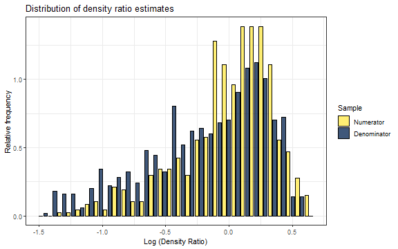

# Introduction

The `densityratio` package offers user-friendly and efficient software for density ratio estimation.
The package contains multiple methods for estimating density ratios, aiming to estimate the ratio of the probability density functions underlying two groups of observations.
This density ratio is estimated using a one-shot procedure, without estimating the separate densities.
The package includes different estimation techniques with built-in hyper-parameter tuning and easy-to-use helper functions to summarize and visualize the results.

In this `getting-started` vignette, we guide the user through the main functionalities of the package.
We start by explaining the concept of density ratio estimation, and the different methods available in the package.
We then show how to estimate density ratios using the `densityratio` package for an example case of distribution shift (i.e., sample selection bias) adaptation.

# Density ratio estimation

The goal of density ratio estimation is to estimate the ratio of two probability density functions,
$$
r(x) = \frac{p_\text{nu}(x)}{p_\text{de}(x)},
$$
based on samples from the numerator ($p_\text{nu}$) and denominator ($p_\text{de}$) distributions.
If the numerator and denominator samples are similar (i.e., they are samples from a common distribution), the density ratio will be close to one over the (multivariate) space of the data.
If the numerator and denominator samples are different, the density ratio will be different from one in those regions where either numerator or denominator samples are overrepresented.
That is, the density ratio will be large in regions where the numerator samples have high density but denominator samples have not, and will be small in regions where the denominator samples have high density but numerator samples have not.
Hence, the estimated density ratio directly shows where and how samples from two distributions differ.


# Data

Throughout the vignette, we illustrate the functionality using the `insurance` dataset.
The dataset is publicly available on Kaggle (e.g., [here](https://www.kaggle.com/datasets/mirichoi0218/insurance)) and is included as example data in the `densityratio` package.
The data contain 1338 observations on the following seven variables:

- `age`: age of the insured (continuous)
- `sex`: sex of the insured (old-fashioned binary variable)
- `bmi`: body mass index of the insured (continuous)
- `children`: number of children/dependents covered by the insurance (integer)
- `smoker`: whether the insured is a smoker (binary variable)
- `region`: the region of the insured (categorical variable with categories `northwest`, `northeast`, `southwest` and `southeast`)
- `charges`: the medical costs billed by the insurance (continuous)

In this vignette, we first discuss the mechanics of the density ratio package for distribution comparison, and then show how it can be used in covariate shift problems.
For these examples, we create training and test data under two settings in which we train a prediction model on the training data to predict insurance charges in the test data.
In the first setting, the test data is randomly drawn from the insurance data, and the remaining cases are used for training (this setting is denoted `rs` throughout, which is short for random sample).
In the second setting (denoted `cs` for `covariate shift`), we split the data based on the region variable, such that the training data contains only cases from the southern regions, while the test data contains cases from the northern regions.
In the second setting, covariate shift may be present, as the different regions may have different distributions on the covariates used in the prediction models.
Importantly, we assume that the conditional distribution of the insurance charges given the covariates is the same in both regions.
This assumption may not hold if the regions also differ on unobserved confounders, but to keep the vignette focused, we ignore this issue here.
We then train a prediction model on the southern regions and use it to predict insurance charges in the northern regions.


``` r
library(densityratio)

set.seed(123)

south <- insurance$region %in% c("southwest", "southeast")
data <- subset(insurance, select = -region)

trainidx_rs <- sample(south)

train_rs <- subset(data, subset = trainidx_rs)
test_rs <- subset(data, subset = !trainidx_rs)

train_cs <- subset(data, subset = south)
test_cs <- subset(data, subset = !south)
```

# Estimating the density ratio

The `densityratio` package includes multiple methods for estimating the density ratio that each has its own estimation function (e.g., unconstrained least-squares importance fitting `ulsif()`, Kullback-Leibler importance estimation procedure `kliep()`, spectral density ratio estimation `spectral()`, and so on).
Each method corresponds to a slightly different model or estimation routine, although all methods use non-parametric estimation techniques based on Gaussian kernel transformations of the input data (with bandwidth parameter $\sigma$ that is automatically tuned through cross-validation).
Moreover, all functions operate similarly.
The user provides two data sets, containing the numerator and denominator samples, and the function returns a `densityratio` object, which can be used and examined.
These `densityratio` objects can always be further inspected with corresponding `summary()` and `plot()` methods.

In what follows, we use unconstrained least-squares importance fitting (ulsif) to estimate the density ratio, as it is fast and efficient.
We remove the outcome variable `charges` from the data before passing it to the `ulsif()` function, because we typically don't have access to the outcome variable in the testing setting.
Hence, we do not want to reweigh samples based on the outcome variable.


``` r
dr_rs <- ulsif(test_rs |> subset(select = -charges),
               train_rs |> subset(select = -charges))
dr_cs <- ulsif(test_cs |> subset(select = -charges),
               train_cs |> subset(select = -charges))
```

The resulting `ulsif` objects contain the estimated density ratio, but also the optimal parameters that can be used to predict the density ratio for new data.


``` r
dr_rs
#> 
#> Call:
#> ulsif(df_numerator = subset(test_rs, select = -charges), df_denominator = subset(train_rs,     select = -charges))
#> 
#> Kernel Information:
#>   Kernel type: Gaussian with L2 norm distances
#>   Number of kernels: 200
#>   sigma: num [1:10] 0.813 1.185 1.366 1.528 1.678 ...
#> 
#> Regularization parameter (lambda): num [1:20] 1000 483.3 233.6 112.9 54.6 ...
#> 
#> Optimal sigma (loocv): 2.802938
#> Optimal lambda (loocv): 2.976351
#> Optimal kernel weights (loocv): num [1:201] 0.01462 0.01017 0.00757 0.00554 0.00745 ...
#> 
```

The output shows the number of inducing points used in the estimation (number of kernels), and the grid of bandwidth (sigma) and regularization parameters (lambda) used in the cross-validation.
Moreover, the output shows the optimal bandwidth parameter, the optimal regularization parameter lambda and the optimal kernel weights, all optimized through leave-one-out cross-validation.


``` r
dr_cs
#> 
#> Call:
#> ulsif(df_numerator = subset(test_cs, select = -charges), df_denominator = subset(train_cs,     select = -charges))
#> 
#> Kernel Information:
#>   Kernel type: Gaussian with L2 norm distances
#>   Number of kernels: 200
#>   sigma: num [1:10] 0.856 1.225 1.416 1.59 1.753 ...
#> 
#> Regularization parameter (lambda): num [1:20] 1000 483.3 233.6 112.9 54.6 ...
#> 
#> Optimal sigma (loocv): 1.224742
#> Optimal lambda (loocv): 0.3359818
#> Optimal kernel weights (loocv): num [1:201] 0.27465 0.0706 0.03061 -0.00883 0.01246 ...
#> 
```

Comparing the two density ratio objects shows that under covariate shift, the optimal bandwidth parameter and regularization parameter are somewhat smaller than under random sampling, which implies that the model is more sensitive to smaller deviations between the two distributions.

One can obtain additional information on the density ratio object by calling the `summary()` function. This function again shows the optimal hyper-parameters, and adds information on the divergence between the two distributions.
Note, here, that different estimation functions typically use different divergence measures.
However, for each estimation function and corresponding divergence measure, one may formally test whether the two distributions are equal using a permutation test.
This can be done by setting the `test = TRUE` argument in the `summary()` function.


``` r
summary(dr_rs, test = TRUE)
#> 
#> Call:
#> ulsif(df_numerator = subset(test_rs, select = -charges), df_denominator = subset(train_rs,     select = -charges))
#> 
#> Kernel Information:
#>   Kernel type: Gaussian with L2 norm distances
#>   Number of kernels: 200
#> 
#> Optimal sigma: 2.802938
#> Optimal lambda: 2.976351
#> Optimal kernel weights: num [1:201] 0.01462 0.01017 0.00757 0.00554 0.00745 ...
#>  
#> Pearson divergence between P(nu) and P(de): 0.02298
#> Pr(P(nu)=P(de)) =  0.28
#> Bonferroni-corrected for testing with r(x) = P(nu)/P(de) AND r*(x) = P(de)/P(nu).
summary(dr_cs, test = TRUE)
#> 
#> Call:
#> ulsif(df_numerator = subset(test_cs, select = -charges), df_denominator = subset(train_cs,     select = -charges))
#> 
#> Kernel Information:
#>   Kernel type: Gaussian with L2 norm distances
#>   Number of kernels: 200
#> 
#> Optimal sigma: 1.224742
#> Optimal lambda: 0.3359818
#> Optimal kernel weights: num [1:201] 0.27465 0.0706 0.03061 -0.00883 0.01246 ...
#>  
#> Pearson divergence between P(nu) and P(de): 0.1221
#> Pr(P(nu)=P(de)) < .001
#> Bonferroni-corrected for testing with r(x) = P(nu)/P(de) AND r*(x) = P(de)/P(nu).
```

These summaries indeed show that the two distributions are not significantly different under random sampling, but differ significantly under our covariate shift setting.
Performing the permutation test might take some time, but it can be sped up by parallelizing the computation (by setting `parallel = TRUE`).


# Visualization methods

The `densityratio` package contains several visualization methods that may aid in interpreting the estimated density ratio.
These plots functions build on the `ggplot2` library, and return a customizable `ggplot` object. The default `plot()` method produces a histogram of the log density ratio values for both groups of samples (numerator and denominator).
The `plot()` function takes several arguments that allow to customize the plot, such as the `samples` argument, which allows to only plot numerator or denominator samples, the `logscale` argument to indicate whether to plot the log density ratio values, and so on (run `?plot.ulsif` for more information).
The default `plot()` summarizes the similarity of the samples through the density ratio.
When the numerator and denominator samples are drawn from the same distribution, the density ratio should be close to 1 (and close to 0 on a log-scale).
Moreover, the distribution of the density ratio values should be very similar for both the numerator and denominator samples.


``` r
plot(dr_rs)
#> `stat_bin()` using `bins = 30`. Pick better value with `binwidth`.
```


In cases where the numerator and denominator samples have different densities, the density ratio values will be different from 1, and more importantly, the distributions of density ratio values over the two groups will overlap to a lesser extent.
Hence, numerator samples will typically have estimated density ratio values larger than 1, while denominator samples will have density ratio values smaller than 1 (or, on a logarithmic scale, larger and smaller than zero, respectively).
This is exactly what we see in the figure below: numerator samples (i.e., the test cases) typically have larger estimated density ratio values than the denominator (training) samples, although the difference is not that large here (but note the different scale of the x-axis compared to the previous plot).
´

``` r
plot(dr_cs)
#> `stat_bin()` using `bins = 30`. Pick better value with `binwidth`.
```



The package comes with two additional plotting functions: `plot_univariate()` and `plot_bivariate()`.
The `plot_univariate()` plots the density ratio values against each variable separately, which can help to identify those variables that are most informative for the density ratio.
Below, we plot the density ratio values against the variables `age` and `bmi` (and set `grid = TRUE` to add the two figures in a grid).
For age there seems no trend: the density ratio values are quite randomly distributed over the age range.
For `bmi`, the pattern is different.
People in the numerator sample (i.e., the test cases), seem to have lower `bmi` values in general, whereas the higher `bmi` values occur more often for the denominator (training) samples.
This results in a higher density ratio for lower `bmi` values, and a lower density ratio for higher `bmi` values.


``` r
plot_univariate(dr_cs, vars = c("age", "bmi"), grid = TRUE)
```


The `plot_bivariate()` function is available to plot the density ratio values for pairs of variables (with the density ratio value mapped to the color scale).
We can again select the variables for which we want to create the scatterplots using `vars`, and the function will create a scatterplot for each pair of variables.
Again, we solely observe a pattern for `bmi`, with higher values corresponding to lower density ratio values.


``` r
plot_bivariate(dr_cs, vars = c("age", "bmi", "children"), grid = TRUE)
```


# Covariate shift

We now show how the `densityratio` package can be used to deal with covariate shift.
Throughout, we attempt to predict the outcome variable `charges` using the predictor variables `age`, `sex`, `bmi`, `children`, and `smoker`.
A common assumption of many statistical analyses is that training and test samples are drawn from the same distribution.
If this assumption is met, least-squares regression (and many other statistical learning techniques, such as random forests and support vector regression) yield consistent estimates of the model parameters, in the sense that the estimates converge to the *optimal* model parameters as the sample size increases.
We can obtain estimates of the model parameters by solving the least-squares problem
$$
\hat{\beta} = \arg\min_{\beta} \sum_{i=1}^{n} (y_{\text{tr}, i} - x_{\text{tr}, i}^T \beta)^2 = (X_\text{tr}^TX_\text{tr})^{-1}X_\text{tr}^Ty_\text{tr},
$$
where $X_\text{tr}$ is the design matrix of the training data, $y_\text{tr}$ is the vector of training outcomes, and $\beta$ is the vector of model parameters.

Under covariate shift, this estimator must no longer be consistent.
In fact, it only is consistent if the analysis model is correctly specified.
This problem can be compensated by reweighing the training samples using the estimated density ratio, which yields a consistent estimator under the true density ratio model
$$
r(x) = \frac{p_\text{test}(x)}{p_\text{train}(x)}.
$$
Since the true density ratio model is not known, all we can do is to estimate it from the training and test data.
Consequently, we have
$$
\hat\beta_\text{R} = \arg\min_{\beta} \sum_{i=1}^{n} \hat{r}_{\text{tr},i} (y_{\text{tr}, i} - x_{\text{tr}, i}^T \beta)^2 = (X_\text{tr}^T \hat{R} X_\text{tr})^{-1}X_\text{tr}^T \hat{R} y_\text{tr},
$$
where the density ratio weights $\hat{r}_{\text{tr},i}$ (collected in the diagonal matrix $\hat R$) are obtained from the estimated density ratio model.


Below, we compare the performance of least squares regression with and without reweighting on the training and test data.
For the sake of illustration, we do this for data under random sampling, and for our covariate shift setting.
We first fit a least squares regression model to the training data, and then predict the outcome variable for the test data, and evaluate the root mean squared error (RMSE) and ($R^2$).

## Performance under random sampling

Without weighting, we simply fit the regression model as follows.


``` r
formula <- charges ~ age + sex + bmi + children + smoker
fit_rs <- lm(formula, data = train_rs)
```

We can then predict the outcome variable for the training and test data, and evaluate the RMSE and $R^2$.


``` r
y_train_rs <- train_rs$charges
y_test_rs  <- test_rs$charges
pred_train_rs <- predict(fit_rs, newdata = train_rs)
pred_test_rs <- predict(fit_rs, newdata = test_rs)

c(
  RMSE_train = sqrt(mean((y_train_rs - pred_train_rs)^2)),
  RMSE_test = sqrt(mean((y_test_rs - pred_test_rs)^2)),
  R2_tr = 1 - var(y_train_rs - pred_train_rs) / var(y_train_rs),
  R2_te = 1 - var(y_test_rs - pred_test_rs) / var(y_test_rs)
)
#>   RMSE_train    RMSE_test        R2_tr        R2_te 
#> 6142.8279347 5990.7051274    0.7503945    0.7455363
```
These calculations show that the RMSE and $R^2$ values are quite similar for the training and test data, which is expected under random sampling.

Subsequently, we fit the regression model with reweighting. We can calculate the weights for the training data using the `predict()` function in the `densityratio` package, and then use these weights in the `lm()` function.


``` r
weights_rs <- predict(dr_rs, newdata = train_rs |> subset(select = -charges))
fit_rs_w <- lm(formula, data = train_rs, weights = weights_rs)

pred_train_rs_w <- predict(fit_rs_w, newdata = train_rs)
pred_test_rs_w <- predict(fit_rs_w, newdata = test_rs)

c(
  RMSE_train = sqrt(mean((y_train_rs - pred_train_rs_w)^2)),
  RMSE_test = sqrt(mean((y_test_rs - pred_test_rs_w)^2)),
  R2_tr = 1 - var(y_train_rs - pred_train_rs_w) / var(y_train_rs),
  R2_te = 1 - var(y_test_rs - pred_test_rs_w) / var(y_test_rs)
)
#>   RMSE_train    RMSE_test        R2_tr        R2_te 
#> 6143.7668763 5995.5513712    0.7503211    0.7451020
```

We see that training and test performance is almost identical to the unweighted solution, which makes sense as the weights are generally very close to 1.

## Performance under covariate shift

We repeat exactly the same procedure as in the previous section, but now for the setting with covariate shift between training and test data.


``` r
fit_cs <- lm(formula, data = train_cs)
```

We again predict the outcome variable for the training and test data, and evaluate the RMSE and $R^2$.


``` r
y_train_cs <- train_cs$charges
y_test_cs  <- test_cs$charges
pred_train_cs <- predict(fit_cs, newdata = train_cs)
pred_test_cs <- predict(fit_cs, newdata = test_cs)

c(
  RMSE_train = sqrt(mean((y_train_cs - pred_train_cs)^2)),
  RMSE_test = sqrt(mean((y_test_cs - pred_test_cs)^2)),
  R2_tr = 1 - var(y_train_cs - pred_train_cs) / var(y_train_cs),
  R2_te = 1 - var(y_test_cs - pred_test_cs) / var(y_test_cs)
)
#>   RMSE_train    RMSE_test        R2_tr        R2_te 
#> 5860.0592523 6434.1388040    0.7944538    0.6722150
```
Now, the performance of the prediction model decreases substantially on the test data, as is expected under covariate shift. Hopefully, we can account for this by reweighing the training data.


``` r
weights_cs <- predict(dr_cs, newdata = train_cs |> subset(select = -charges))
fit_cs_w <- lm(formula, data = train_cs, weights = weights_cs)

pred_train_cs_w <- predict(fit_cs_w, newdata = train_cs)
pred_test_cs_w <- predict(fit_cs_w, newdata = test_cs)

c(
  RMSE_train = sqrt(mean((y_train_cs - pred_train_cs_w)^2)),
  RMSE_test = sqrt(mean((y_test_cs - pred_test_cs_w)^2)),
  R2_tr = 1 - var(y_train_cs - pred_train_cs_w) / var(y_train_cs),
  R2_te = 1 - var(y_test_cs - pred_test_cs_w) / var(y_test_cs)
)
#>   RMSE_train    RMSE_test        R2_tr        R2_te 
#> 6005.6703347 6191.6472513    0.7841192    0.6971867
```

We see that we get a modest improvement in the RMSE and $R^2$ values for the test data, compared to the unweighted solution.
The fact that the improvement is not larger can have multiple reasons.
First, of course, the estimated density ratio model is not perfect, which may lower the performance of the reweighted regression model.
Second, we have no way of knowing whether our important assumption, namely that only the covariate distribution of train and test set changed, is actually met.
There could very well be unobserved processes that affect the selection mechanism and the outcome.
Finally, it could very well be that the performance under random sampling is not even attainable, because, for example, the distribution of the outcome is different in the two settings.


``` r
lm(formula, data = test_cs) |>
  summary()
#> 
#> Call:
#> lm(formula = formula, data = test_cs)
#> 
#> Residuals:
#>    Min     1Q Median     3Q    Max 
#>  -8867  -3221  -1166   1187  27132 
#> 
#> Coefficients:
#>               Estimate Std. Error t value Pr(>|t|)    
#> (Intercept) -12619.838   1419.984  -8.887  < 2e-16 ***
#> age            242.068     17.155  14.111  < 2e-16 ***
#> sexmale          8.815    477.858   0.018 0.985287    
#> bmi            379.957     43.460   8.743  < 2e-16 ***
#> children       759.908    201.638   3.769 0.000179 ***
#> smokeryes    21320.176    605.795  35.194  < 2e-16 ***
#> ---
#> Signif. codes:  0 '***' 0.001 '**' 0.01 '*' 0.05 '.' 0.1 ' ' 1
#> 
#> Residual standard error: 6077 on 643 degrees of freedom
#> Multiple R-squared:  0.7061,	Adjusted R-squared:  0.7038 
#> F-statistic:   309 on 5 and 643 DF,  p-value: < 2.2e-16
```
Fitting the same model on the ***test*** data shows that, given our model specification, an $R^2 = 0.71$ is the best we can do, which suggests that our reweighted model is already quite close to the best possible performance.

# Conclusion

In this vignette, we showed how the `densityratio` package can be used to estimate the density ratio between two data sets, and how the density ratio can be used to reweigh the training data in a regression model under covariate shift.


